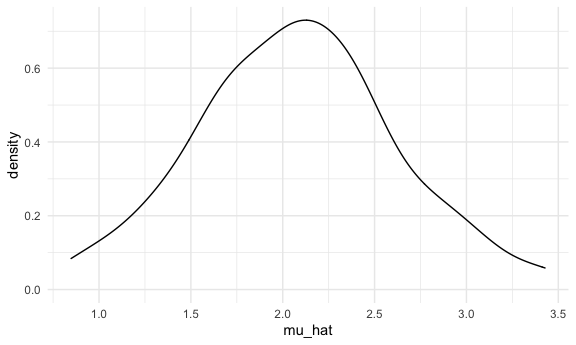
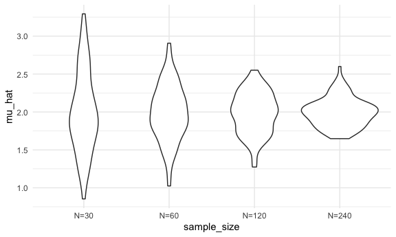
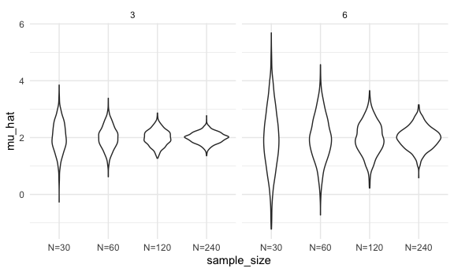

simulation
================
Jennifer Lee
2022-11-03

``` r
library(tidyverse)
```

    ## ── Attaching packages ─────────────────────────────────────── tidyverse 1.3.2 ──
    ## ✔ ggplot2 3.3.6      ✔ purrr   0.3.4 
    ## ✔ tibble  3.1.8      ✔ dplyr   1.0.10
    ## ✔ tidyr   1.2.0      ✔ stringr 1.4.1 
    ## ✔ readr   2.1.2      ✔ forcats 0.5.2 
    ## ── Conflicts ────────────────────────────────────────── tidyverse_conflicts() ──
    ## ✖ dplyr::filter() masks stats::filter()
    ## ✖ dplyr::lag()    masks stats::lag()

``` r
knitr::opts_chunk$set(
echo = TRUE,
warning = FALSE,
  fig.width = 6,
  fig.asp = .6,
  out.width = "90%")

theme_set(theme_minimal() + theme(legend.position = "bottom"))

options(
  ggplot2.continuous.colour = "viridis",
  ggplot2.continuous.fill = "viridis")

scale_colour_discrete = scale_colour_viridis_d
scale_fill_discrete = scale_fill_viridis_d
```

## Simulations!!!

Here’s our function from before

``` r
sim_mean_sd = function(n_obs, mu = 2, sigma = 3) {
  
    x = rnorm(n = n_obs, mean = mu, sd = sigma)
  
  tibble(
      mu_hat = mean(x),
      sigma_hat = sd(x)
    )
}
```

How did we use this before?

``` r
sim_mean_sd(n_obs = 30)
```

    ## # A tibble: 1 × 2
    ##   mu_hat sigma_hat
    ##    <dbl>     <dbl>
    ## 1   1.09      2.69

How can we use this now… Let’s start with a for loop!

``` r
output = vector("list", length = 100)

for (i in 1:100) {
  output[[i]] = sim_mean_sd(n_obs = 30)
}

bind_rows(output)
```

    ## # A tibble: 100 × 2
    ##    mu_hat sigma_hat
    ##     <dbl>     <dbl>
    ##  1   1.06      3.38
    ##  2   1.23      3.99
    ##  3   2.59      3.03
    ##  4   2.91      3.58
    ##  5   1.92      3.25
    ##  6   1.32      2.86
    ##  7   2.39      2.91
    ##  8   1.45      3.52
    ##  9   1.98      2.28
    ## 10   1.96      3.37
    ## # … with 90 more rows

Let’s use list columns instead.

``` r
sim_results_df = 
  expand_grid(
    sample_size = 30,
    iteration = 1:100
  ) %>%
  mutate(
    estimate_df = map(sample_size, sim_mean_sd)
  ) %>%
  unnest(estimate_df)
```

``` r
sim_results_df %>%
  ggplot(aes(x = mu_hat)) +
  geom_density()
```



## what about changing the sample size?

``` r
sim_results_df = 
  expand_grid(
    sample_size = c(30, 60, 120, 240),
    iteration = 1:100
  ) %>%
  mutate(
    estimate_df = map(sample_size, sim_mean_sd)
  ) %>%
  unnest(estimate_df)
```

``` r
sim_results_df %>%
  mutate(
    sample_size = str_c("N=", sample_size), 
    sample_size = fct_inorder(sample_size)) %>%
  ggplot(aes(x = sample_size, y = mu_hat)) +
  geom_violin()
```



``` r
sim_results_df %>%
  mutate(
    sample_size = str_c("N=", sample_size), 
    sample_size = fct_inorder(sample_size)) %>%
  group_by(sample_size) %>%
  summarize(
    emp_st_error = sd(mu_hat)
  )
```

    ## # A tibble: 4 × 2
    ##   sample_size emp_st_error
    ##   <fct>              <dbl>
    ## 1 N=30               0.537
    ## 2 N=60               0.373
    ## 3 N=120              0.276
    ## 4 N=240              0.191

## Let’s see two inputs…

``` r
sim_results_df = 
  expand_grid(
    sample_size = c(30, 60, 120, 240),
    true_sigma = c(6,3),
    iteration = 1:1000
  ) %>%
  mutate(
    estimate_df = 
      map2(.x = sample_size, .y = true_sigma, ~sim_mean_sd(n_obs = .x, sigma = .y))
  ) %>%
  unnest(estimate_df)

sim_results_df %>%
  mutate(
    sample_size = str_c("N=", sample_size), 
    sample_size = fct_inorder(sample_size)) %>%
  ggplot(aes(x = sample_size, y = mu_hat)) +
  geom_violin() +
  facet_grid(.~true_sigma)
```


